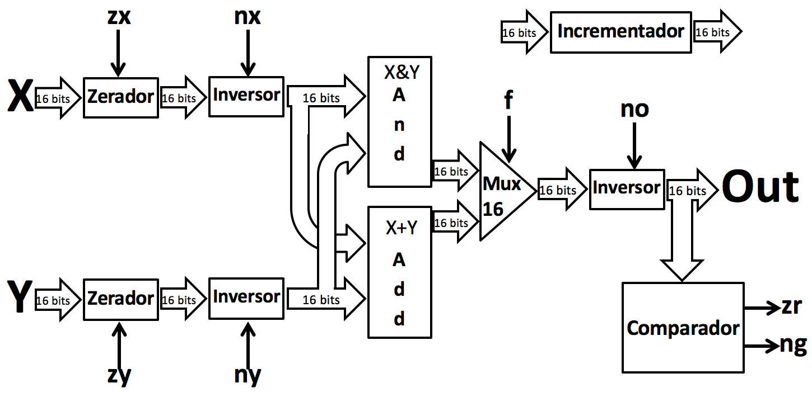

Prazo de entrega : 06/9/2017

# Descrição

Neste projeto você terá de desenvolver os componentes para a implementação de uma unidade lógica aritmética completa de 16 bit. O desenvolvimento será na linguagem VHDL com o git. Os alunos deverão subdividir a ALU em módulos e duplas de alunos desenvolverão cada parte. O facilitador escolhido será responsável pela completude e consistência do branch master.

## Integrantes

Este projeto é para ser realizado por todos os integrantes do grupo. Tarefas
devem ser criadas no Trello e alunos poderão executar elas em duplas, pratique
pair-programming, porém evite sempre trabalhar com a mesma dupla, ou seja,
cada projeto deverá ser realizado por uma nova dupla. Se organizem para tentar
desenvolver o projeto de forma que todos aprendam o máximo possível, embora
só um integrante de uma dupla possa fazer os commits para o github. Converse
com os colegas a respeito do projeto, mas não aceite código pronto.

## Controle de Tarefas e Repositório

Atualize seu Fork do repositório do projeto do github:

- https://github.com/Insper/Z0

Nas discussões com os outros alunos, escolha um módulo da ALU para desenvolver. Defina o desenvolvimento do módulo no Trello. Crie uma rotina para commits e testes dos módulos e verifique se está fazendo o esperado:

- https://trello.com/engcompinsper2017

## Instruções trabalho em equipe

Cada dupla deve desenvolver pelo menos duas entidades, não podendo as duas serem do mesmo tipo. Após validada a entidade, submeta um pullquest para que o facilitador do projeto aprove e faça o merge no branch master.

Cada dupla deve desenvolver pelo menos um módulo da ALU. Após validado, submeta um pullquest para que o facilitador do projeto aprove e faça o merge no branch master. 

# Intruções

A pasta contém dois diretórios distintos : src/ e Quartus/. O diretório src contém os arquivos fontes que deverão ser editados para implementar o projeto. O diretório quartus/ contém o projeto que possibilitará compilar os módulos e testar em hardware.

## src

Deve-se implementar os seguintes circuitos combinacionais que compõem a ALU diagramada a seguir :



- HalfAdder
    - **Arquivo**   : HalfAdder.vhd
    - **Descrição** : Adiciona dois bits (soma = a+b), retornando o carry (vaium).
    
- FullAdder
    - **Arquivo**   : FullAdder.vhd
    - **Descrição** : Adiciona três bits (soma = a+b+X), retornando o carry (vaium).
 
- Inversor 16 bits 
    - **Arquivo**   : inversor16.vhd
    - **Descrição** : Inverte uma palavra de 16 bits ( y = NOT a[15..0]) se sinal de controle = 1.
    
    ```
    if(z=1) 
        y = not a
    if(z=0)
        y = a
    ```
    
- Zerador 16 bits
    - **Arquivo**   : zerador16.vhd
    - **Descrição** : Zera uma palavra de 16 bits se sinal de controle = 1, caso contrário mantém o sinal.
    
    ```
    if(z=1) 
        y = 0
    if(z=0)
        y = x
    ```

- Comparador 16 bits
    - **Arquivo**   : And16.vhd
    - **Descrição** : And bit a bit entre duas palavras de 16 bits.

- AND 16 bits
    - **Arquivo**   : And16.vhd
    - **Descrição** : And bit a bit entre duas palavras de 16 bits.
   
- ADD 16 bits
    - **Arquivo**   : Add16.vhd
    - **Descrição** : Adiciona duas palavras de 16 bits (q = a[15..0] + b[15..0]), ignorando o carry.
    
    ```
    q[15..0] = a[15..0] + b[15..0]
    ```

## Testando em SW

Para executarmos uma unidade de teste em cada módulo, executamos o comando

```bash
python testes.py
```

Esse comando executa um teste unitário em cada um dos módulos, verificando se sua implementação está correta. O resultado é exibido na tela como : **pass** ou **fail**.

## Testando em HW


## DICAS

Algumas dicas para o projeto :

- 

# Avaliação :

## Itens necessários para o aceite

- Implementar em grupo todos os módulos funcionando.

## Validação

- Demonstrar em hardware duas implementações escolhidas pelo Professor.
- Teste no :

## Rubrica

| Nota máxima | Descritivo                             |
|-------------|----------------------------------------|
| A           | - Entregue no prazo                    |
|             | - Todos os itens corretos              |
|             | - Implementações ótimas (otimizados)   |
| B           | - Entregue no prazo                    |
|             | - Todos os itens corretos              |
| C           | - Entregue fora do prazo, ou           |
| D           | - 80% dos itens entregues corretamente |
| I           | - Não entregue                         |
|             | - Menos que 80% dos itens corretos     |
